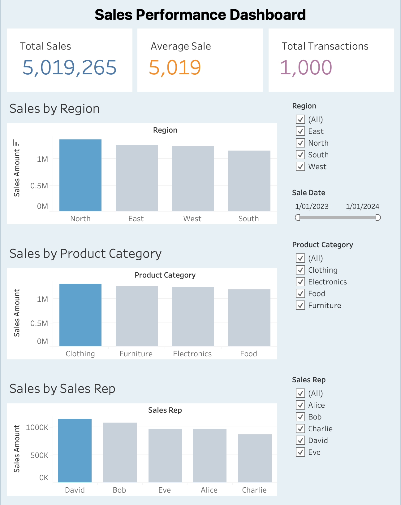

# Sales Data Analysis Project

SQL and Tableau project analyzing sales data to extract business insights.

---

## 📊 Overview
This project uses SQL-based analysis to explore a sales dataset and extract meaningful business insights. The analysis focuses on performance metrics, customer behavior, product trends, and profitability.

The goal is to support data-driven decision-making through structured queries and aggregated reporting.

---

## 📷 Dashboard Preview

---

## 🎯 Project Objectives
- Analyze revenue and transaction patterns
- Identify top-performing regions and sales representatives
- Evaluate product category performance
- Understand customer behavior (new vs returning)
- Assess profitability at product level

---

## 🧑‍💻 Author

**Freddy Higa**

---

## 📂 Dataset Description

The dataset contains sales transactions with the following key fields:

- `sales_amount` – total value of a transaction  
- `sale_date` – date of the transaction  
- `region` – geographic region of the sale  
- `sales_rep` – salesperson responsible for the sale  
- `product_category` – category of the product sold  
- `product_id` – unique product identifier  
- `customer_type` – new or returning customer  
- `payment_method` – method of payment  
- `sales_channel` – channel used for the sale  
- `quantity_sold` – number of units sold  
- `unit_price` – selling price per unit  
- `unit_cost` – cost per unit  

---

## 📈 Analysis Performed

### 1. Overall Performance
- Total revenue
- Total number of transactions
- Average sales per transaction

### 2. Regional Performance
- Revenue by region
- Identification of top-performing regions

### 3. Sales Performance
- Ranking of sales representatives using SQL window functions (RANK)

### 4. Product Analysis
- Performance by product category
- Region–category performance comparisons

### 5. Customer Insights
- Revenue contribution from new vs returning customers

### 6. Payment & Channel Analysis
- Most frequently used payment methods
- Revenue distribution by sales channel

### 7. Profitability Analysis
- Revenue, cost, and profit per product
- Identification of high-profit vs high-revenue products

### 8. Time Series Analysis
- Monthly sales trends based on sale_date

---

## 🧠 SQL Concepts Used

- Aggregate functions: SUM, COUNT, AVG
- GROUP BY and ORDER BY
- Window functions RANK()
- Date handling functions (TO_CHAR, TO_DATE)
- Derived columns for profit calculation
- Multi-dimensional grouping

---

## 🚀 How to Run the Project

1. Load the dataset into a SQL database.
2. Ensure the table name is sales.
3. Execute queries individually in your SQL environment.
4. Use outputs for reporting or dashboard creation.

---

## 🛠 Tools & Technologies
- Oracle Database (Docker)  
- SQL Developer  
- SQL (aggregation, grouping, filtering)  
- Tableau (for visualization)

---

## 🧠 Key Insights
- The North region generated the highest revenue, indicating strong market performance.  
- Returning customers contributed more revenue than new customers.  
- Clothing and Furniture categories were the main revenue drivers.  
- Sales performance varies significantly between sales representatives, with clear differences between top and bottom performers. 
- Higher revenue does not guarantee higher profitability, as lower-revenue products can achieve better margins and generate more profit per sale.
- Regional performance varies, with North highest and South lowest, highlighting opportunities for targeted improvement in weaker regions.

---

## 🚀 Conclusion
This project demonstrates how SQL can transform raw transactional data into meaningful business insights. The results support improvements in sales strategy, customer targeting, and product profitability analysis.

---

## 📊 Future Improvements

- Add customer lifetime value (CLV) analysis  
- Include cohort analysis for customer retention  
- Build dashboard in Power BI / Tableau  
- Automate reporting with Python or dbt 
